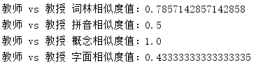
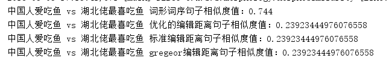
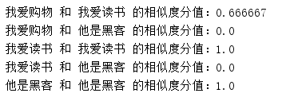
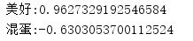
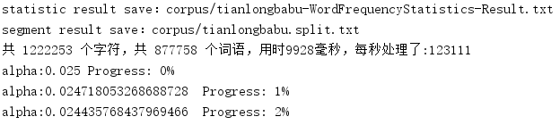
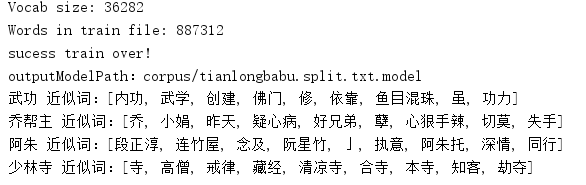

# similarity
用于词语、短语、句子、词法分析、情感分析、语义分析等相关的相似度计算。

**similarity**是由一系列算法组成的Java版相似度计算工具包，目标是传播自然语言处理中相似度计算方法。**similarity**具备工具实用、性能高效、架构清晰、语料时新、可自定义的特点。

**similarity**提供下列功能：

> * 词语相似度计算
  * 词林编码法相似度
  * 汉语语义法相似度
  * 知网词语相似度
  * 字面编辑距离法
> * 短语相似度计算
  * 简单短语相似度
> * 句子相似度计算
  * 词性和词序结合法
  * 编辑距离算法
  * Gregor编辑距离法
  * 优化编辑距离法
> * 文本相似度计算
  * 余弦相似度
  * 编辑距离算法
  * 欧几里得距离
  * Jaccard相似性系数
  * Jaro距离
  * Jaro–Winkler距离
  * 曼哈顿距离
  * SimHash + 汉明距离
  * Sørensen–Dice系数
> * 词法分析
  * xmnlp中文分词
  * 分词词性标注
  * 词频统计
> * 知网义原
  * 义原树
> * 情感分析
  * 正面倾向程度
  * 负面倾向程度
  * 情感倾向性
> * 近似词
  * word2vec


在提供丰富功能的同时，**similarity**内部模块坚持低耦合、模型坚持惰性加载、词典坚持明文发布，使用方便，帮助用户训练自己的语料。

------
## Todo

文本相似性度量


* [done]关键词匹配（TF-IDF、BM25）
* []浅层语义匹配（WordEmbed隐语义模型，用word2vec或glove词向量直接累加构造的句向量）
* []深度语义匹配模型（DSSM、CLSM、DeepMatch、MatchingFeatures、ARC-II、DeepMind，具体依次参考下面的Reference）

欢迎大家贡献代码及思路，完善本项目

## Reference

* [DSSM] Po-Sen Huang, et al., 2013, Learning Deep Structured Semantic Models for Web Search using Clickthrough Data
* [CLSM] Yelong Shen, et al, 2014, A Latent Semantic Model with Convolutional-Pooling Structure for Information Retrieval 
* [DeepMatch] Zhengdong Lu & Hang Li, 2013, A Deep Architecture for Matching Short Texts
* [MatchingFeatures] Zongcheng Ji, et al., 2014, An Information Retrieval Approach to Short Text Conversation
* [ARC-II] Baotian Hu, et al., 2015, Convolutional Neural Network Architectures for Matching Natural Language Sentences
* [DeepMind] Aliaksei Severyn, et al., 2015, Learning to Rank Short Text Pairs with Convolutional Deep Neural Networks


------

## Usage

### word similarity
```
public static void main(String[] args) {
    String word1 = "教师";
    String word2 = "教授";
    double cilinSimilarityResult = Similarity.cilinSimilarity(word1, word2);
    double pinyinSimilarityResult = Similarity.pinyinSimilarity(word1, word2);
    double conceptSimilarityResult = Similarity.conceptSimilarity(word1, word2);
    double charBasedSimilarityResult = Similarity.charBasedSimilarity(word1, word2);

    System.out.println(word1 + " vs " + word2 + " 词林相似度值：" + cilinSimilarityResult);
    System.out.println(word1 + " vs " + word2 + " 拼音相似度值：" + pinyinSimilarityResult);
    System.out.println(word1 + " vs " + word2 + " 概念相似度值：" + conceptSimilarityResult);
    System.out.println(word1 + " vs " + word2 + " 字面相似度值：" + charBasedSimilarityResult);
}
    
```
demo code position: test/java/org.xm/WordSimilarityDemo.java

* result:



### phrase similarity
```
public static void main(String[] args) {
    String phrase1 = "继续努力";
    String phrase2 = "持续发展";
    double result = Similarity.phraseSimilarity(phrase1, phrase2);

    System.out.println(phrase1 + " vs " + phrase2 + " 短语相似度值：" + result);
}

```
demo code position: test/java/org.xm/PhraseSimilarityDemo.java

* result:


### sentence similarity
```
public static void main(String[] args) {
    String sentence1 = "中国人爱吃鱼";
    String sentence2 = "湖北佬最喜吃鱼";

    double morphoSimilarityResult = Similarity.morphoSimilarity(sentence1, sentence2);
    double editDistanceResult = Similarity.editDistanceSimilarity(sentence1, sentence2);
    double standEditDistanceResult = Similarity.standardEditDistanceSimilarity(sentence1,sentence2);
    double gregeorEditDistanceResult = Similarity.gregorEditDistanceSimilarity(sentence1,sentence2);

    System.out.println(sentence1 + " vs " + sentence2 + " 词形词序句子相似度值：" + morphoSimilarityResult);
    System.out.println(sentence1 + " vs " + sentence2 + " 优化的编辑距离句子相似度值：" + editDistanceResult);
    System.out.println(sentence1 + " vs " + sentence2 + " 标准编辑距离句子相似度值：" + standEditDistanceResult);
    System.out.println(sentence1 + " vs " + sentence2 + " gregeor编辑距离句子相似度值：" + gregeorEditDistanceResult);
}

```
demo code position: test/java/org.xm/SentenceSimilarityDemo.java

* result:




### text similarity
```
@Test
public void getSimilarityScore() throws Exception {
    String text1 = "我爱购物";
    String text2 = "我爱读书";
    String text3 = "他是黑客";
    TextSimilarity similarity = new CosineSimilarity();
    double score1pk2 = similarity.getSimilarity(text1, text2);
    double score1pk3 = similarity.getSimilarity(text1, text3);
    double score2pk2 = similarity.getSimilarity(text2, text2);
    double score2pk3 = similarity.getSimilarity(text2, text3);
    double score3pk3 = similarity.getSimilarity(text3, text3);
    System.out.println(text1 + " 和 " + text2 + " 的相似度分值：" + score1pk2);
    System.out.println(text1 + " 和 " + text3 + " 的相似度分值：" + score1pk3);
    System.out.println(text2 + " 和 " + text2 + " 的相似度分值：" + score2pk2);
    System.out.println(text2 + " 和 " + text3 + " 的相似度分值：" + score2pk3);
    System.out.println(text3 + " 和 " + text3 + " 的相似度分值：" + score3pk3);

}

```

demo code position: test/java/org.xm/similarity/text/CosineSimilarityTest.java

* result:



### word frequency statistics
demo code position: test/java/org.xm/tokenizer/WordFreqStatisticsTest.java

* result:


分词及词性标注内置调用[HanLP](https://github.com/hankcs/HanLP)，也可以使用我们NLPchina的[ansj_seg](https://github.com/NLPchina/ansj_seg)分词工具。


### sentiment analysis based on words
```
@Test
public void getTendency() throws Exception {
    HownetWordTendency hownet = new HownetWordTendency();
    String word = "美好";
    double sim = hownet.getTendency(word);
    System.out.println(word + ":" + sim);
    System.out.println("混蛋:" + hownet.getTendency("混蛋"));
}

```

demo code position: test/java/org.xm/tendency.word/HownetWordTendencyTest.java

* result:



本例是基于义原树的词语粒度情感极性分析，关于文本情感分析有[classifier-in-action](https://github.com/shibing624/classifier-in-action)，利用深度神经网络模型、SVM分类算法实现的效果更好。

### homoionym(use word2vec)
```
@Test
public void testHomoionym() throws Exception {
    List<String> result = Word2vec.getHomoionym(RAW_CORPUS_SPLIT_MODEL, "武功", 10);
    System.out.println("武功 近似词：" + result);
}

@Test
public void testHomoionymName() throws Exception {
    String model = RAW_CORPUS_SPLIT_MODEL;
    List<String> result = Word2vec.getHomoionym(model, "乔帮主", 10);
    System.out.println("乔帮主 近似词：" + result);

    List<String> result2 = Word2vec.getHomoionym(model, "阿朱", 10);
    System.out.println("阿朱 近似词：" + result2);

    List<String> result3 = Word2vec.getHomoionym(model, "少林寺", 10);
    System.out.println("少林寺 近似词：" + result3);
}
    
```

demo code position: test/java/org.xm/word2vec/Word2vecTest.java

* train:



* result:



训练词向量使用的是阿健实现的java版word2vec训练工具[Word2VEC_java](https://github.com/NLPchina/Word2VEC_java)，训练语料是小说天龙八部，通过词向量实现得到近义词。
用户可以训练自定义语料，也可以用中文维基百科训练通用词向量。